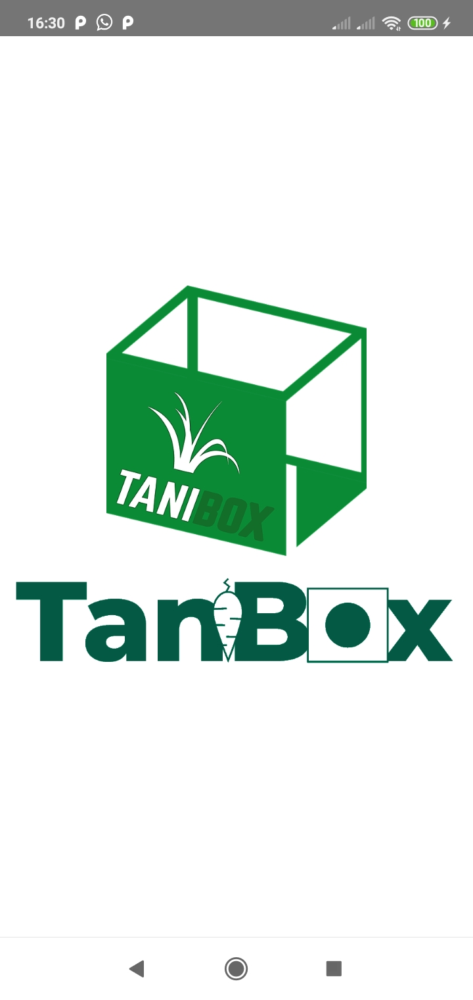
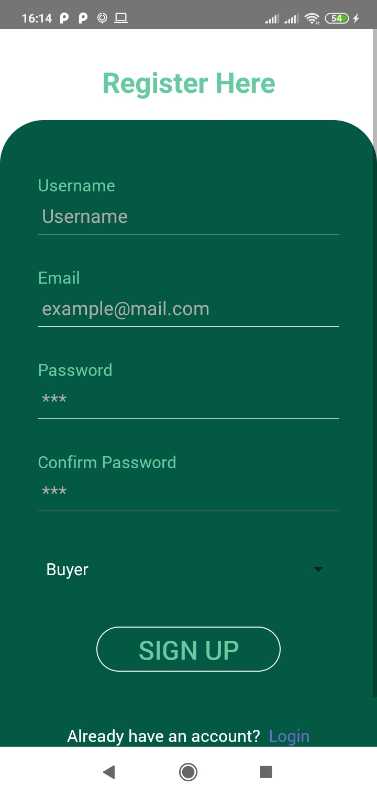
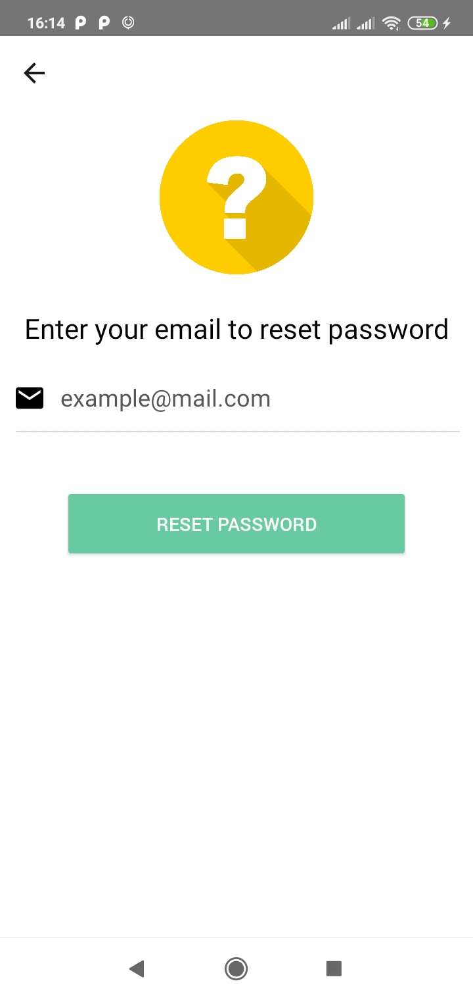
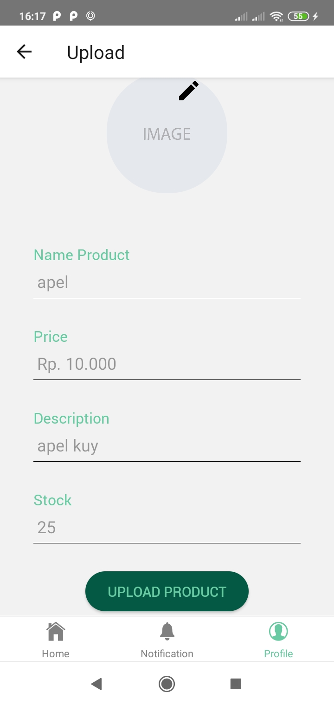
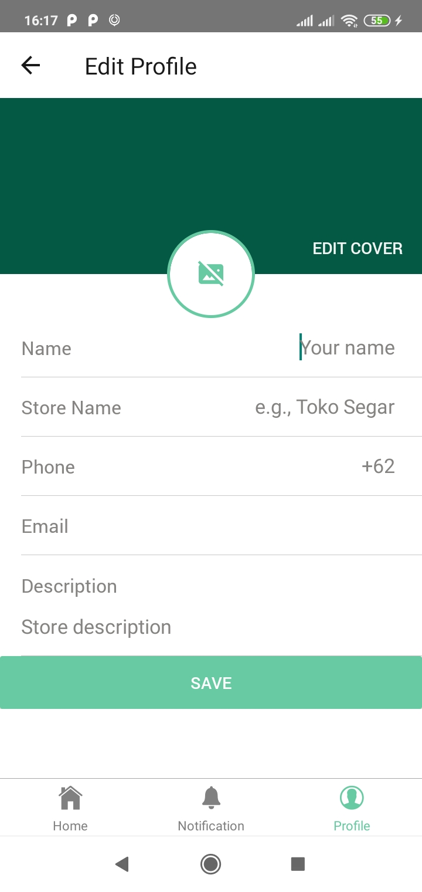
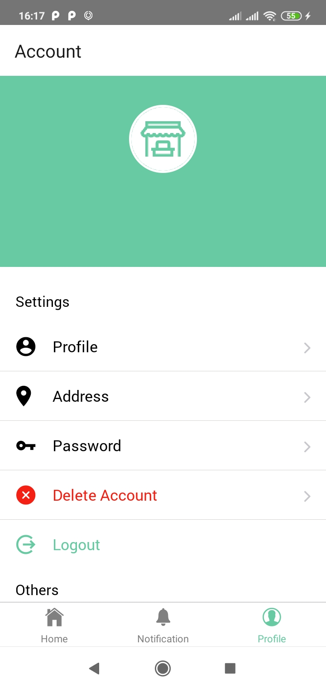

<h1 align="center">TaniBox</h1>
<p align="center">
  
  
</p>
<p align="center">
  Built with React Native.
</p>

## Table of Contents

- [Introduction](#introduction)
- [Requirements](#requirements)
- [Usage](#usage-for-development)
- [Create Environment Variable](#create-environment-variable)
- [Screenshots](#screenshots)
- [Release APK](#release-apk)
- [Related Project](#related-project-backend)
- [Contributors](#contributors)

## Introduction

<b>TaniBox</b> TaniBox is an application for buying and selling fresh fruits and vegetables. The concept is that buyers can look for fruits and vegetables according to their region.

## Requirements

- [`npm`](https://www.npmjs.com/get-npm)
- [`react-native`](https://facebook.github.io/react-native/docs/getting-started)
- [`react-native-cli`](https://facebook.github.io/react-native/docs/getting-started)
- [`Backend TaniBox`](https://github.com/reihnagm/TaniBox-Backend)

## Usage for development

1. Open your terminal or command prompt
2. Type `git clone https://github.com/iipshoifuddin/TaniBox-ReactNative`
3. Open the folder and type `npm install` for install dependencies
4. Create Environment Variable [here](#create-environment-variable)
5. Before run this, you must run backend first
6. Type `react-native run-android` for run this app. **_Make sure your device is connected with debugging mode_**.

## Create Environment Variable

```
$ cp .env.example .env
$ nano .env
```

```
# Set API KEY
API_ENDPOINT=Your endpoint API
BASE_URL=Your Base URL
ONESIGNAL_API_KEY=Your Onesignal API Key
```

## Screenshots

<div align="center">
    
    
    
    
    
    
    
    
    
</div>

## Release APK

<a href="https://drive.google.com/file/d/1C3gwW5q147gR0uOQyVVjwpkiTuskn1ul/view?usp=sharing">
  
</a>

## Related Project (Backend)

- [`Backend TaniBox`](https://github.com/reihnagm/TaniBox-Backend)

## Contributors

<center>
<ul>

</ul>
  <table align="center">
    <tr>
      <td align="center">
        <a href="https://github.com/halim13">
          <br/>
        </a>
          <sub><b>Halim Hasanudin</b></sub><br/>
          <sub>(React native)</sub>
      </td>
      <td align="center">
        <a href="https://github.com/MBambangSumantri">
          <br/>
        </a>
          <sub><b>M. Bambang Sumantri</b></sub><br/>
          <sub>(React native)</sub>
      </td>
      <td align="center">
        <a href="https://github.com/MBambangSumantri">
          <br/>
        </a>
          <sub><b>Luhut Andreas</b></sub><br/>
          <sub>(React native, Express Js)</sub>
      </td>
      <td align="center">
        <a href="https://github.com/iipshoifuddin">
          <br/>
        </a>
          <sub><b>Iip Shoifuddin</b></sub><br/>
          <sub>(React native)</sub>
      </td>
      <td align="center">
        <a href="https://github.com/bayuyuhartono">
          <br/>
        </a>
          <sub><b>Bayu P Yuhartono</b></sub><br/>
          <sub>(React native, Express Js)</sub>
      </td>
      <td align="center">
        <a href="https://github.com/reihnagm">
          <br/>
        </a>
          <sub><b>Reihan Agam</b></sub><br/>
          <sub>(React native, Express Js)</sub>
      </td>
    </tr>
  </table>
</center>
