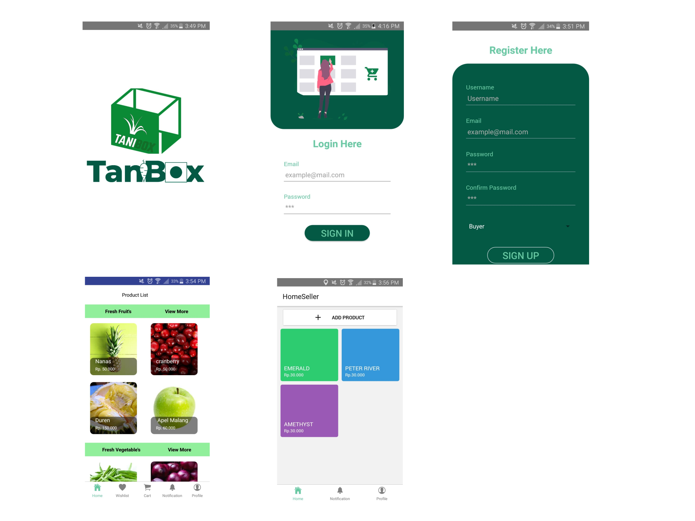

# Tani Box

TaniBox is an Android application that (movement) in the Argocultural that allows farmers to sell fresh fruits and vegetables directly.



## pre-Instalation

before installing this application, first install Node JS

_https://nodejs.org/en/download/

## Installation

OS X & Linux & Windows:

```sh
npm init
```

```sh
npm install
```


## Development setup

Before using this application, first enter the project folder _your_project and create a dotEnv file:

Linux :
```sh
cp example.ENV .ENV
```

Windows :
```sh
copy example.ENV .ENV /a
```

then edit the file as follows :
```sh
API_ENDPOINT=http://34.202.135.29:4000/api/v1/

ONESIGNAL_API_KEY=1bf005c4-154a-4587-851d-b502ebc6ea62

DARK_GREEN = #035943
GREEN = #68CAA2
WHITE = #FFFFFF
BLUE = #686FCA
```


## Running

Before using this application, first enter the project folder _your_project and create a dotEnv file:
